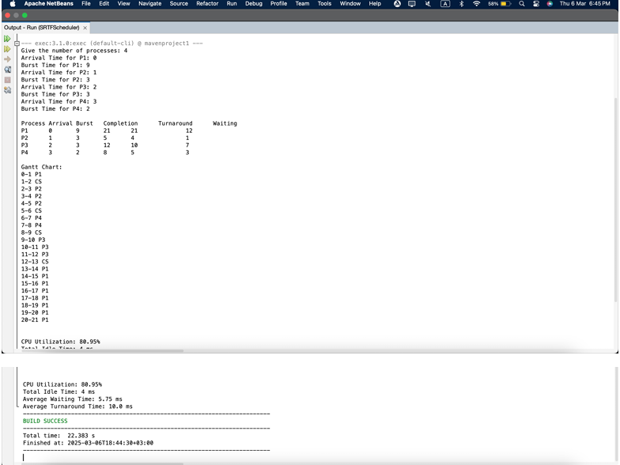

<body>
  <h1>Process Scheduling Simulator</h1>

  <h2>Project Overview</h2>
  

    This project implements a <strong>preemptive Shortest Remaining Time First (SRTF)</strong> scheduling algorithm
    to simulate a process scheduling environment. In case of equal remaining burst times, the <strong>First Come First Serve (FCFS)</strong> policy is used.
  

  

    The simulation is <strong>event-driven</strong> and maintains a queue of events such as process arrivals, starts, completions, and context switches.
    A context switch takes <strong>1 ms</strong>.
  

  <h2>Program Features</h2>
  <ul>
    <li>User inputs number of processes, along with arrival and burst times.</li>
    <li>Simulates process execution with preemptive scheduling logic.</li>
    <li>Visualizes scheduling timeline using a Gantt chart.</li>
    <li>Calculates and displays:
      <ul>
        <li>CPU Utilization</li>
        <li>Average Turnaround Time</li>
        <li>Average Waiting Time</li>
      </ul>
    </li>
    <li>Demonstrates both preemption and FCFS conditions.</li>
  </ul>

  <h2>Sample Output</h2>
  <pre>
Number of processes = 4
Processes: P1, P2, P3, P4

P1: Arrival = 0, Burst = 8
P2: Arrival = 1, Burst = 4
P3: Arrival = 2, Burst = 5
P4: Arrival = 3, Burst = 5

Scheduling Algorithm: Shortest Remaining Time First
Context Switch Time: 1 ms

Gantt Chart:
Time    Process
0-1     P1
1-2     CS
2-6     P2
6-7     CS
7-12    P3
12-13   CS
13-18   P4
18-19   CS
19-26   P1

Performance Metrics:
Average Turnaround Time: 14 ms
Average Waiting Time: 8.5 ms
CPU Utilization: 84.62%
  </pre>

  <h2>Screenshots</h2>
  

   
    
This screenshot demonstrates the First-Come-First-Served (FCFS) behavior when processes have 
equal burst times.

  

  

   
    
This screenshot demonstrates the preemptive behavior of the Shortest Remaining Time First (SRTF) 
algorithm.

  

</body>
